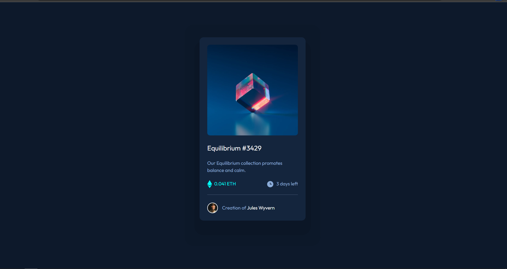
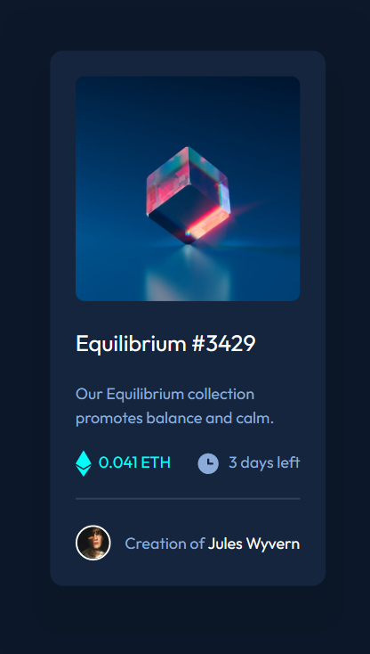

# Frontend Mentor - NFT preview card component solution

### Screenshot

</h2>Desktop View</h2>

  

</h2>Mobile View</h2>

### Links

- Solution URL: (https://github.com/CodeChd/nft)
- Live Site URL: (https://nft-card-fe-cj.netlify.app/)

## My process

### Built with

- Semantic HTML5 markup
- CSS custom properties
- Flexbox
- CSS Grid
- Vite
- [React](https://reactjs.org/) - JS library

### What I learned

"I discovered that I have bit difficulty with stacking elements or overlaying them on top of each other. As a result, I have been searching on Google for the best practices on how to accomplish this effectively."
